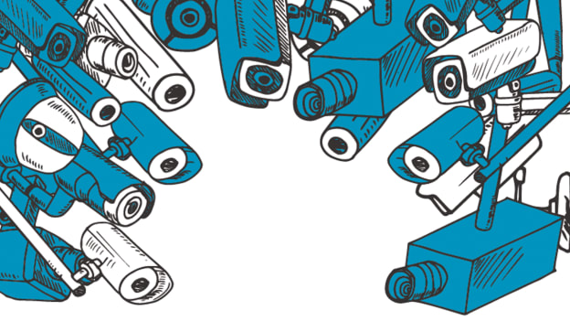
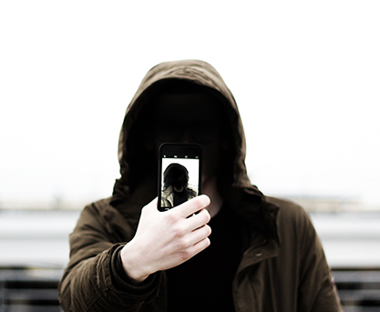
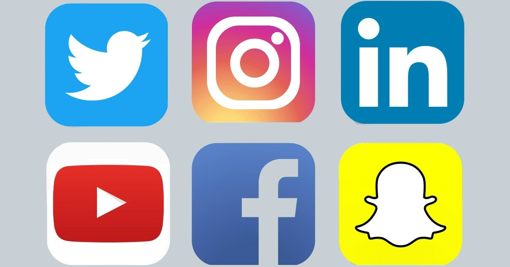
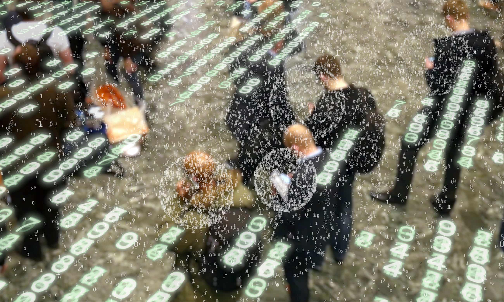
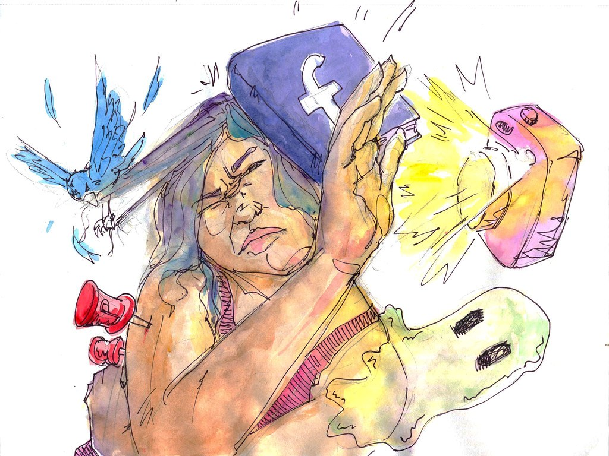
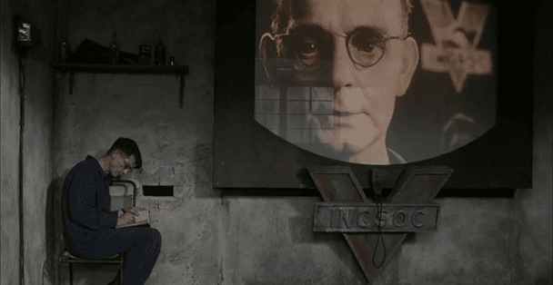
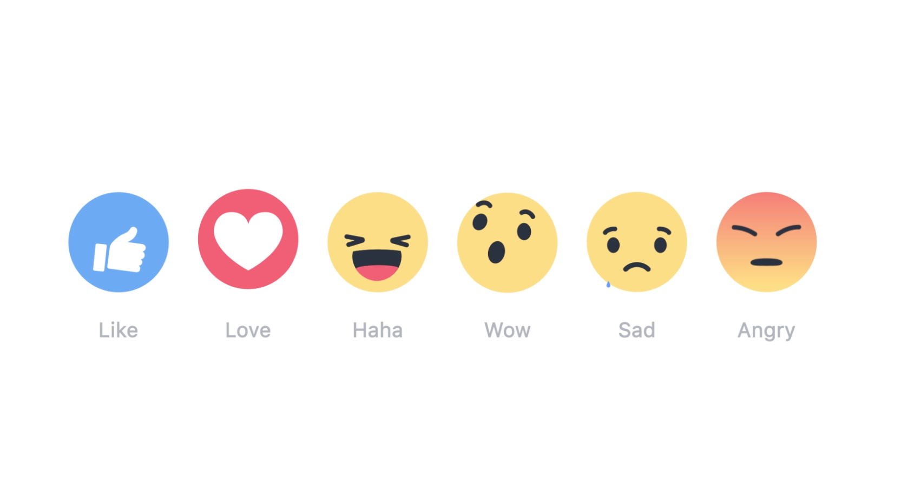

##

\center
"Está emergindo uma cultura da vigilância sem precedentes..."

## 

\center
{width=250px}

\center
"as pessoas participam ativamente em uma tentativa de regular sua própria vigilância e a vigilância sobre outros" (p. 151)

## O que é cultura de vigilância?

\justify
>"a vigilância se torna parte de todo um modo de vida. Daí meu uso da palavra **cultura**. Não é mais apenas algo externo que se impõe em nossa vida. É algo que os cidadãos comuns aceitam – deliberada e conscientemente ou não –, com que negociam, a que resistem, com que se envolvem e, de maneiras novas, até iniciam e desejam. O que antes era um aspecto institucional da modernidade ou um modo
tecnologicamente aperfeiçoado de disciplina ou controle social hoje está internalizado e constitui parte de reflexões diárias sobre como são as coisas e do repertório de práticas cotidianas" (pp.152-153)

## Modernidade digital do século XXI

- Primavera árabe - 2010

- Edward Snowden - 2013

- "Cidadania mediada pela digital" (p.153)

## Estado, Sociedade e Cultura de Vigilância

- No princípio era o partido...

- Depois vieram as empresas...

- E agora estão em toda parte!

## Somos cúmplices!

\center
{width=300px}

\justify
>"boa parte daqueles dados é gerada, em primeiro lugar, pelas atividades cotidianas online de milhões de cidadãos comuns" (p.154)

## Somos cúmplices!

\center
{width=300px}

\justify
> "Somos cúmplices, como jamais antes, em nossa própria vigilância ao compartilhar – por vontade própria e conscientemente ou não – nossas informações pessoais no domínio público online" (p.154)

## Capitalismo de vigilância - Shoshana Zuboff

\center
{width=300px}

\justify
>“prever e modificar o comportamento humano como meio de produzir receitas e controle de mercado” (p.156)

## A vigilância é para o seu próprio bem!

\center
{width=300px}

[Clique aqui!](https://www.youtube.com/watch?v=g13UgUWSfIc) 

## Eu quantificado

- Automonitoramento da saúde, da renda, administração do tempo

- Apps: ciclo menstrual, nutrição, dinheiro, comprar, locais visitados, etc.

\justify
>"as pessoas buscam uma forma de 'autoconhecimento' para que possam levar 'vidas melhores', ainda que apenas um pequeno fragmento dos dados seja visto por elas, e a vasta maioria termine na base de dados das corporações dos aparelhos portáteis." (p.157)

## Dataísmo - José van Dick 

\center
{width=250px}

\justify
>"podemos confiar nossos dados seguramente às grandes corporações"

## "Compartilharás tudo que acontecer"

\center
{width=250px}

\center
> Estamos em um frenesi digital

## Sociedade de exposição

- Exposição: compartilhar afetos, amores, tristezas, predileções, denúncias, pedidos de ajuda, desejos, compras, término de namoro, etc.

- Frenesi digtial: "menos que esteja em mídias sociais, 'você não existe'" (Danah Boyd)

## Vigilância enquanto prazer

\center
{width=250px}

\justify
>Antes a vigilância era encarada como opressora, destruidora do prazer. Hoje ele é vista como um dos nossos prazeres cotidianos (p.167)

## "Avaliarás o semelhante como a ti mesmo"

\center
{width=350px}

\justify
> A todo momento somos incitados a avaliar o outro (dar nota, corações, etc) e o que ele posta, a opinar (muitas vezes sem conhecimento algum sobre o assunto) a indiferença não é permitida  

## Ética digital: que fazer?

\justify
- Vísivel e o invisível: quem aparece, quem nunca aparece, quem aparece muito?
(regimes algorítmos de in/visibilidade - Taina Bucher);

- É preciso compreender a pluralidade de aspectos do usos das tecnologias digitais sem criticar, culpabilizar, menosprezar as pessoas;

- Como resistir?

##

\center
Perguntas? Dúvidas?

