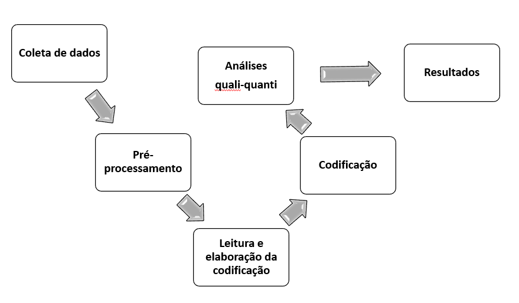
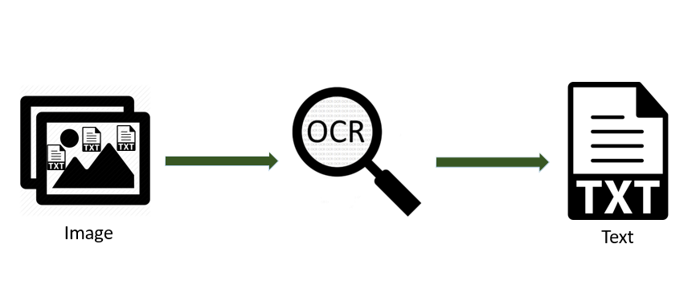
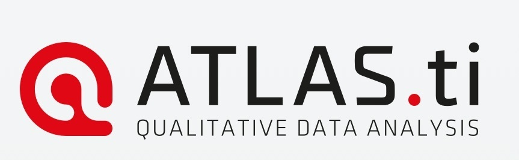
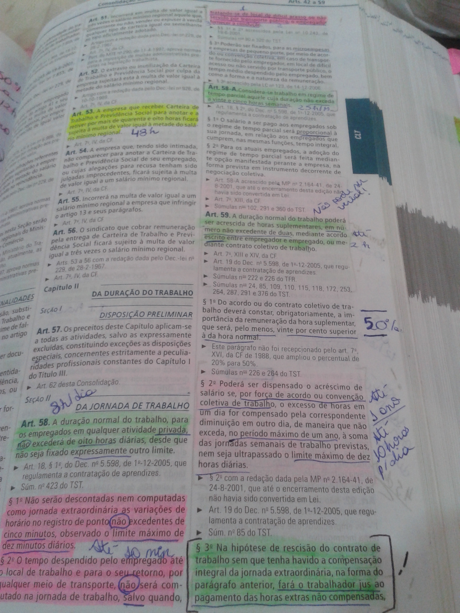

layout: true
  
<div class="my-footer"><span>
<a>Pesquisando jornais digitalizados com ATLAS.ti</a>
</span></div>


---
class: middle, center
```{r setup, include=FALSE}
options(htmltools.dir.version = FALSE)

knitr::opts_chunk$set(
	echo = FALSE,
	fig.align = "center",
	message = FALSE,
	warning = FALSE,
	cache = FALSE
)
```

```{r eval=FALSE, include=FALSE}
library(knitr)
library(tidyverse)
library(widgetframe)
```

# Leonardo F. Nascimento

```{r out.width="15%"}

```
15% Programador, 20% Químico, 25% Psicólogo, 40% Cientista Social

[Email: **leofn@ufba.br**](mailto:leofn@ufba.br) 

[Twitter:**@leofn3**](http://www.twitter.com/leofn3) 

[website: **www.leofn.com**](http://www.leofn.com)

---

class: middle, center  

```{r, out.width="30%"}
knitr::include_graphics("img/logo_MA_color.png")
```

# LABHDUFBA nas redes:


Twitter: [@labhdufba](https://twitter.com/labhdufba), 
  
  
Instagram: [@labhdufba](http://instagram.com/labhdufba)
  
  
Github: [https://github.com/LABHDUFBA](https://github.com/LABHDUFBA)
  
  
Youtube: [Clique aqui](https://www.youtube.com/channel/UCjUf9BsbG-C-gpA54zvOgBw)

---
class: inverse, center, middle

# Vamos começar!

---
class: middle, center

## Por que os jornais são uma excelente fonte de pesquisa?

--

**1. Conteúdo multimodal: texto, imagens, estatísticas;** 

--

**2. Ampla variedade de tópicos: notícias, romances, humor, clima, nascimentos e mortes, saúde, política etc;** 

--

**3. Captura detalhes da vida cotidiana no passado - eventos e (detalhes de) discussões que não chegaram à história;**

--

**4. Acompanhar processos de longa duração.**


---
class: middle, center

## Fases da Pesquisa

--

```{r, out.width="90%"}

```

---
class: middle, center

## Coleta dos dados

--

**1. Uso de Web scraping (Python/R);** 

--

**2. Hemerotecas e acervos digitais/digitalizados;** 

--

**3. Nomeação sistemática;** 

--

**4. Aspectos computacionais;** 

---
class: middle, center

## Pré-processamento

--
**OCR: Reconhecimento Óptico de Caracteres** 

```{r, out.width="100%"}

```

---
class: middle, center

## Ferramentas para OCR


**[gImageReader](https://sourceforge.net/projects/gimagereader/)**


**[ABBYY](https://www.abbyy.com/)**


**[Pytessereract](https://pypi.org/project/pytesseract/)**

---
class: middle, center

## Leitura e elaboração da codificação

--

**1. top-down (dedutivo) x bottom-up (indutivo)**

--

**2. Codificação como epicentro da pesquisa qualitativa**

--

**3. Sistematicidade: buscar rigorosamente similaridades, diferenças, frequência, sequência, correspondência, causalidade. (Hatch, 2002, p. 155)**

--

**4. Códigos descritivos (jornal, data, codificador, título, formato, autor) X códigos analíticos**

--

**5. Filtragem por centralidade do tema**

---
class: middle, center

```{r, out.width="100%"}

```

---
class: middle, center

## ATLAS.ti: "Archive of Technology, Life world and Language” 

--

**1. QDA ou CAQDAS**

--

**2. Organização e sistematicidade**

--

**3. Grandes volumes de dados** 

--

**4. Trabalho em equipe** 

---
class: middle, center

```{r, out.width="100%"}

```

---
class: middle, center

## ATLAS.ti: elementos

--

**1. Documentos(primary documents, P-docs, PD)**

--

**2. Códigos (codes)**

--

**3. Citações (quoatations)** 

--

**4. Anotações (memos)** 

--

**5. Família ou grupos** 

--

**6. Redes (networks)** 

---
class: middle, center

## ATLAS.ti: procedimentos

**1. Inserção de documentos(após OCR)**

--

**2. Criação de famílias/grupos**

--

**3. Criação de códigos**

--

**4. Codificação ||=========>    **

--

**4. Análises quali-quanti**

---
class: inverse, center, middle

# ATLAS.ti 7 em ação!

---

class: center, middle

# Referências bibliográficas

AUERBACH, C.; SILVERSTEIN, L. B. Qualitative Data: An Introduction to Coding and Analysis. NYU Press, 2003. 

FRIESE, S. Qualitative Data Analysis with ATLAS.ti. Second Edition edition ed. SAGE Publications Ltd, 2014. 

HATCH, J. A. Doing Qualitative Research in Education Settings. SUNY Press, 2010. 

SALDANA, J. The Coding Manual for Qualitative Researchers. [s.l.] SAGE, 2015. 

SILVER, C.; LEWINS, A. Using Software in Qualitative Research: A Step-by-Step Guide. Second Edition ed. London: SAGE, 2014. 

---
class:  middle

## Obrigado gente!
.pull-left[
```{r, out.width="100%"}
knitr::include_graphics("https://media1.giphy.com/media/3oz8xIsloV7zOmt81G/giphy.gif")
```
]

.pull-right[
**Agradecimentos especiais**:
- Prof. Fernando Rodrigues - Pelo convite!
- [Tarssio](https://github.com/tarssioesa) - Pelas dicas no script em R para o Larribar
- [Beatriz Milz do R-Ladies](https://github.com/beatrizmilz/IME-27-08-2019) - De quem eu "garfei" esta apresentação e modifiquei]

