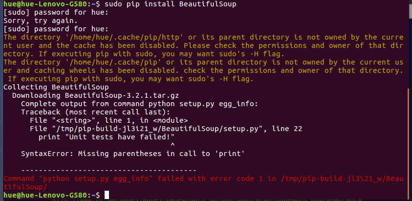

layout: true
```{r setup, include=FALSE}
options(htmltools.dir.version = FALSE)

knitr::opts_chunk$set(
	echo = FALSE,
	fig.align = "center",
	message = FALSE,
	warning = FALSE,
	cache = FALSE
)
```
---
class: middle, center
--
# Pressupostos do webscraping
<br>

--
## Computação ubíqua/digitalização 
<br>

--
## dataficação
<br>

--
## 

---
class: middle, center

--
# Web Scraping
<br>

--
## Coleta automatizada de dados na WEB através do uso de "scrapers"
<br>

--
## É diferentes de "tirar prints"!


---
class: middle, center
--
# Scrapers
<br>

--
## Scrapers são códigos/scripts ( em linguagens de programação) que possibilitam o download automático de dados da Web e a captura de algumas das grandes quantidades de dados sobre a vida social disponíveis na web.

---
class: middle, center

--
# Webscraping como "processo de destilação" 
<br>

--
## como extrair dados úteis(heurísticos) de um conjunto heterogêneo de infos?
<br>

--
## Raspagem consiste na exclusão dos "elementos inúteis" de modo a produzir um conjunto de dados bem ordenado e utilizável;
<br>

--
## Depois da raspagem uma série de etapas adicionais se seguem, nas quais os dados são limpos em operações sucessivas

---
class: middle, center

--
# Webscraping: "técnica de coleta de dados" ou "dispositivo analítico"?
<br>

--
## Todo scraper possui uma "epistemologia" dentro dele
<br>

--
## Redução da complexidade, heterogeneidade, "sujeira"
<br>

--
## Intercâmbio de pesquisa, reutilização de códigos, dimensão prática 
<br>

---
class: middle, center
# Desafios da pesquisa com dados em webscraping
<br>

--
## publicidade/acessibilidade
<br>

--
## evocação versus coleta
<br>

--
## representatividade
<br>

--
## pré-construção	algorítimica das informações
<br>

--
## capacidade computacional
<br>

---
class: middle, center
# Desafios da pesquisa com dados em webscraping
<br>

--
## letramento digital dos pesquisadores
<br>

--
## atentar para as escolhas no código 
<br>

--
## cuidado com o soterramento! (download *versus* capacidade analítica)
<br>

--
## Não invisibilizar o método, nem "esconder" os dados

---
class: inverse, center, middle

# Provocações: 
<br>

##0 Um "erro no código" passa a constituir um "erro metodológico"?

```{r, out.width="100%"}

```

---
class: middle, center

# "nossos ajudantes digitais já estão cheios de teoria e julgamento" (Bernhard Rieder and Theo Röhle in: BERRY, 2012, p. 70)

```{r, out.width="50%"}
knitr::include_graphics("img/bender.jpg")
```

---
class: middle, center

# “Não existe neutralidade metodológica das técnicas” 
(BOURDIEU; PASSERON; CHAMBOREDON, 2004, p. 55)

```{r, out.width="45%"}
knitr::include_graphics("img/bourdieu.jpg")
```
---
class: middle, center

## Obrigado gente!

.pull-left[
```{r, out.width="100%"}
knitr::include_graphics("https://media.giphy.com/media/KzKHlzSlfHZV44EdTy/giphy.gif")
```
]
.pull-right[
##**Agradecimentos especiais**:

]

