layout: true

```{r setup, include=FALSE}
options(htmltools.dir.version = FALSE)

knitr::opts_chunk$set(
	echo = FALSE,
	fig.align = "center",
	message = FALSE,
	warning = FALSE,
	cache = FALSE
)
```

```{r eval=FALSE, include=FALSE}
library(knitr)
library(tidyverse)
library(widgetframe)
```

---

class: middle, center  

```{r, out.width="65%"}
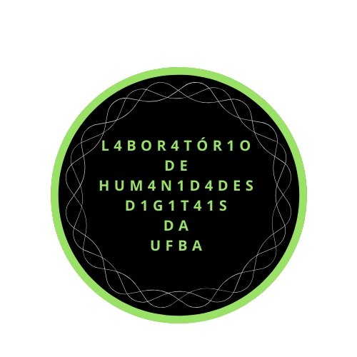
```


Twitter: [@labhdufba](https://twitter.com/labhdufba) 
<br>
Instagram: [@labhdufba](http://instagram.com/labhdufba)
<br>
Github: [https://github.com/LABHDUFBA](https://github.com/LABHDUFBA)
<br>
Youtube: [Clique aqui](https://www.youtube.com/channel/UCjUf9BsbG-C-gpA54zvOgBw)


---
class: inverse, center, middle

# Aspectos gerais das sociedades digitais contemporâneas...

---
class: middle, center

## "Digitalização do eu na vida cotidiana" 

```{r, out.width="80%"}
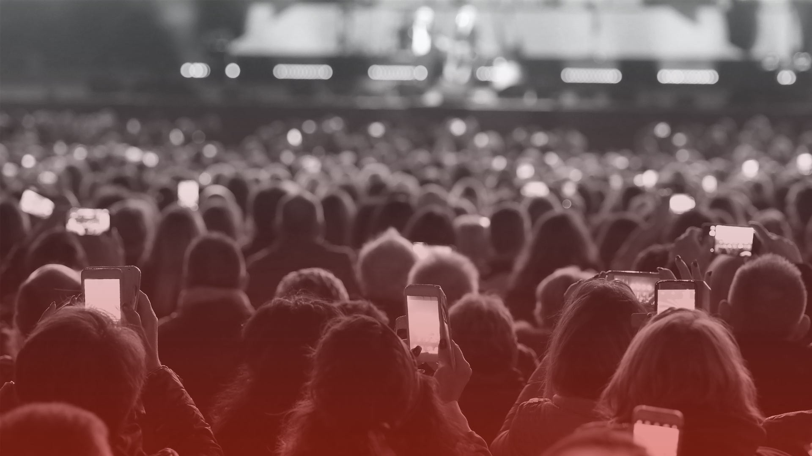
```
---
class: middle, center

## Algoritmização de processos sociais

```{r, out.width="60%"}
knitr::include_graphics("img/matrix-digital-self.png")
```

---
class: middle, center

## Traços digitais (digital data trace)

```{r, out.width="75%"}
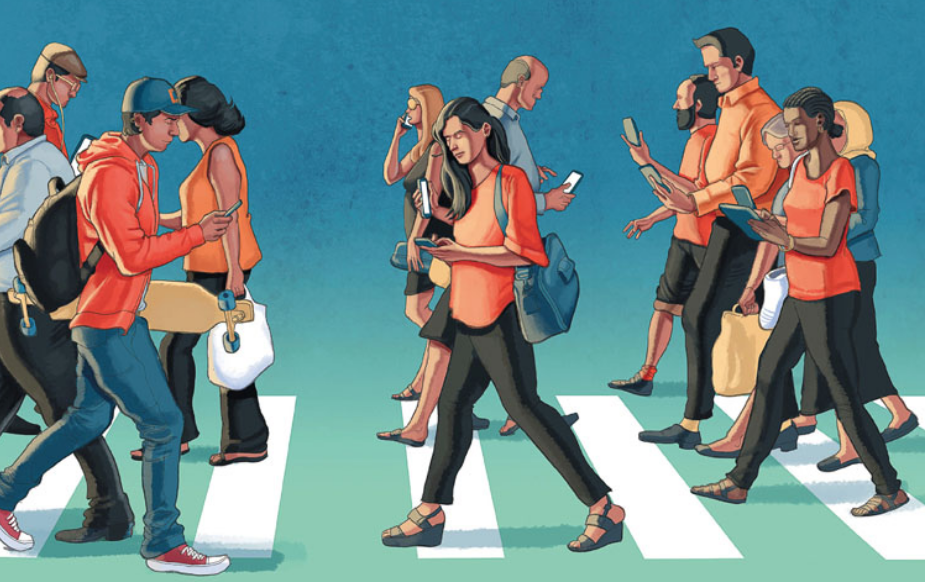
```

> "registros de atividade realizados por meio de um sistema de informação online (portanto, digital). Um traço é uma marca deixada como sinal de passagem; é uma evidência registrada de que algo ocorreu no passado" (HOWISON et alli, 2011)

---
class: middle, center

## Dataficação

```{r, out.width="75%"}
knitr::include_graphics("img/datafication4.jpg")
```

> "Dataficação refere-se ao processo pelo qual sujeitos, objetos e práticas são transformados em dados digitais" (SOUTHERTON, 2020) 

---
class: middle, center

## Cultura de vigilância


```{r, out.width="65%"}
knitr::include_graphics("img/surv.jpg")
```

> "Não é mais algo externo que se impôe em nossa vida. É algo que os cidadãos comuns aceitam - deliberadamente e conscientemente ou não - com que negociam, a que resistem, com que se envolvem e, de maneiras novas, até inciam e desejam" (LYON, 2020) 

---
class: inverse, center, middle

# Uso político das redes sociais digitais

---
class:center, middle
# Os protestos de 2013 e a ascensão da extrema-direita


```{r, out.width="65%"}
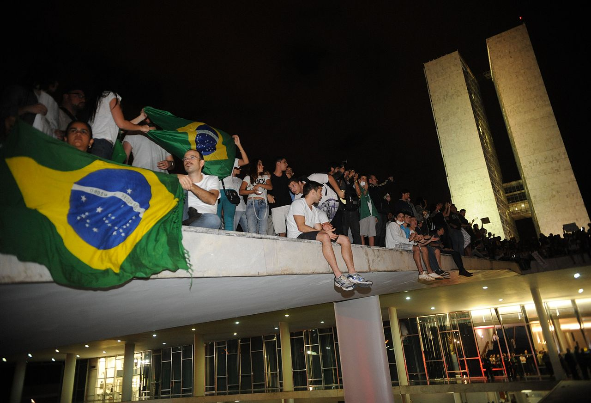
```

---
class:center, middle
# Pré-eleição: retroalimentação midiática  
<br>


```{r, out.width="65%"}
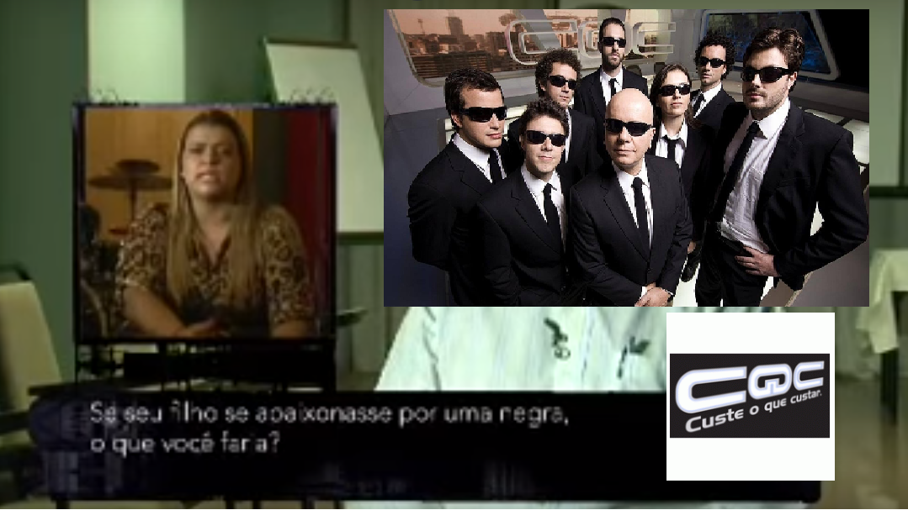
```


---
class:center, middle
# Eleição e WhatsApp
<br>

```{r, out.width="65%"}
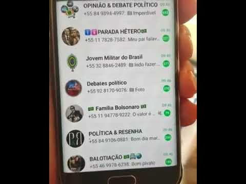
```

---
class:center, middle
# Contexto atual: intensificação e ocultamento
<br>

--
### Pandemia: isolamento social, uso de máscara, cloroquina e vacina
<br>

--
### Crise econômica e humanitária sem precedentes
<br>

--
### Desplataformização (Rogers, 2020)
<br>

---
class: inverse, center, middle

# O que vem para 2022?

---
class:center, middle
# Telegram como plataforma da extrema-direita
<br>

```{r, out.width="65%"}

```

---
class:center, middle
# Telegram como plataforma da extrema-direita
<br>

--
### Anonimato 
<br>

--
### Maior alcance
<br>

--
### Uso de robôs (BOTs) 
<br>

--
### WhatsApp coadjuvante 
<br>

---
class: inverse, center, middle

# Dados

---
class:center, middle
## Grupos público mais antigo 12k de usuários, 2018-2020 (meio milhão de msgs)
<br>

```{r, out.width="100%"}
knitr::include_graphics("img/1cut.png")
```

---
class:center, middle
## Presença de "animadores"
<br>

```{r, out.width="100%"}
knitr::include_graphics("img/2cut.png")
```

---
class:center, middle
## Ecossistema multiplataforma e câmara de eco
<br>

```{r, out.width="100%"}
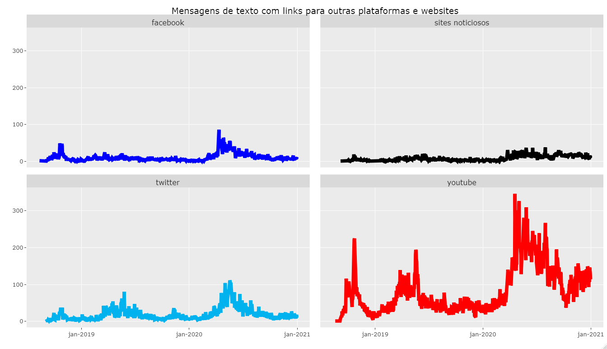
```
---
class:center, middle
## a)"amigo e inimigo"; b) líder e povo; c)mobilização por ameaça; d) mimesis inversa; e) deslegitimação de fontes de informação (CESARINO, 2020).
<br>

```{r, out.width="100%"}
knitr::include_graphics("img/4cut.png")
```
---
class:center, middle
## "Contra os poderes estabelecidos"
<br>

```{r, out.width="100%"}
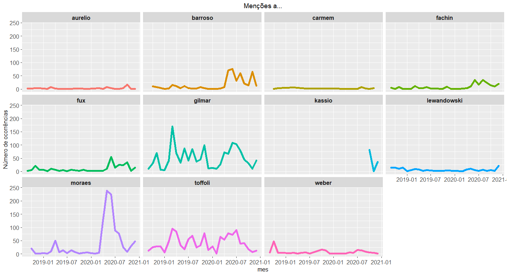
```
---
class:center, middle
## Crescimento dos grupos
<br>

```{r, out.width="100%"}
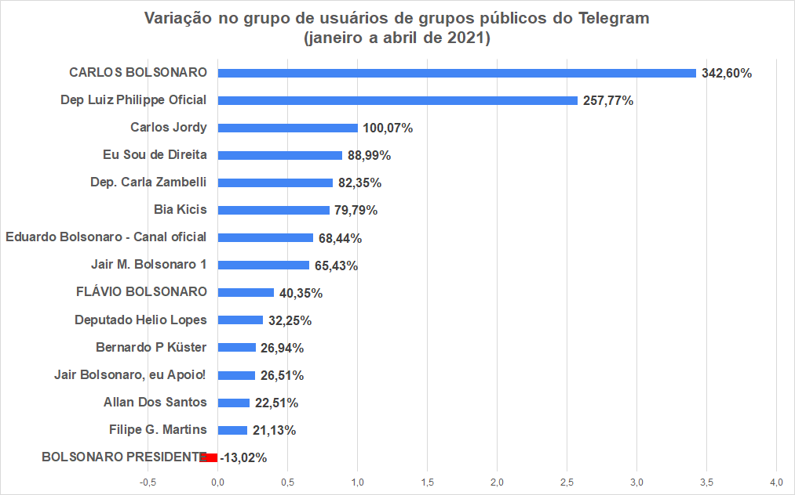
```

---
class:center, middle
# Complexo e sofisticado sistema de desinformação e convencimento
<br>

--
## Formação de inimigos comuns
<br>

--
## ciência patriótica x ciência comunista
<br>

--
## Laços de solidariedade
<br>

--
## Mobilização de temas sensíveis à sociedade brasileira
<br>

---
class: inverse, center, middle

--
# Que fazer? 
<br>

--
# O que vem primeiro as redes sociais ou os protestos reais?

---
class:center, middle
# A política vem primeiro!
<br>

```{r, out.width="70%"}
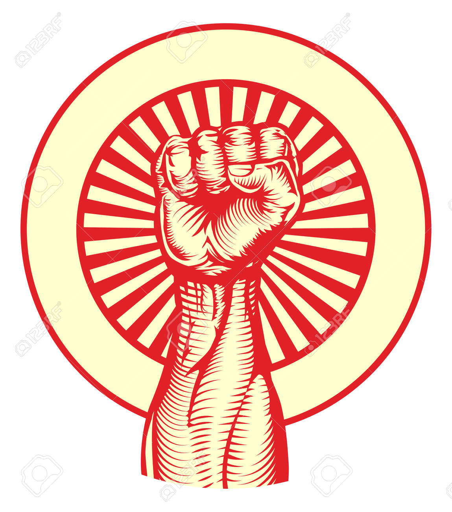
```

---
class:center, middle
# A política vem primeiro!
<br>

--
### Analiticamente: "Não se pode entender o papel das mídias sociais na ação coletiva sem primeiro levar em conta o ambiente político em que operam." (WOLFSFELD, SEGEV & SHEAFER, 2013, p.119)
<br>


--
### Cronologicamente: "As mídia sociais devem ser vista como facilitadora de protestos, e não como causa" (WOLFSFELD, SEGEV & SHEAFER, 2013, p.120)
<br>

--
### "É mais provável que uma mobilizição nas redes cresça/viralize **após** um protesto ou evento do que **antes** de acontecer alguma coisa..." 

---
class: middle, center

```{r, out.width="75%"}
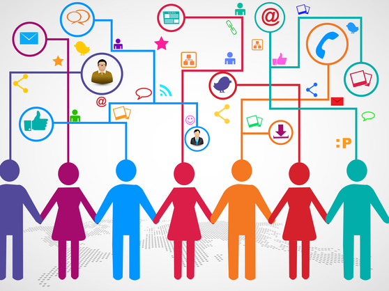
```

>A mudança política leva a mudanças no uso das mídias sociais (por exemplo, mais pessoas entrando e usando as mídias sociais para conteúdo político), o que pode levar a novas mudanças no ambiente político (como mais pessoas participando de protestos).(WOLFSFELD, SEGEV & SHEAFER, 2013)

---
class: middle, center

## Referências Bibliográficas

AVRITZER, Leonardo. Impasses da democracia no Brasil. Rio de Janeiro: Editora Civilização Brasileira, 2016.
<br>

CESARINO, L. 2020. Como vencer uma eleição sem sair de casa: a ascensão do populismo digital no Brasil. Internet & Sociedade, 1(1): 91-120. Disponível em: <https://revista.internetlab.org.br/serifcomo-vencer-uma-eleicao-sem-sair-de-casa-serif-a-ascensao-do-populismo-digital-no-brasil/>. Acesso em: 05/05/2020. 
<br>

NASCIMENTO, L. et al. “Não falo o que o povo quer, sou o que o povo quer”: 30 anos (1987-2017) de pautas políticas de Jair Bolsonaro nos jornais brasileiros. Plural, v. 25, n. 1, p. 135–171, 14 ago. 2018. 
<br>

WOLFSFELD, G.; SEGEV, E.; SHEAFER, T. Social Media and the Arab Spring: Politics Comes First. The International Journal of Press/Politics, v. 18, n. 2, p. 115–137, 1 abr. 2013. <br>

SANTOS, N.; SILVA, M. Midiativismo em rede: Twitter e as críticas aos meios de comunicação tradicionais em um sistema híbrido de comunicação. Esferas, p. 18, 13 ago. 2019. 
 

---
class: middle, center

## Obrigado gente!

.pull-left[
```{r, out.width="70%"}
knitr::include_graphics("https://media.giphy.com/media/JQRVMKkWAQbdiXFBkg/giphy.gif")
```
]
.pull-right[
##**Agradecimentos especiais**:
### Profa Luciene da Cruz Fernandes (UFBA/ICS) - Pelo convite!
<br>
### Ao público pela paciência!
]

