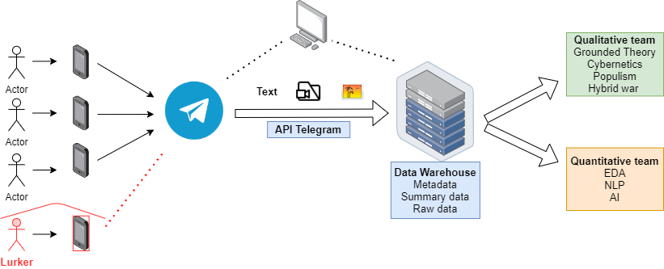
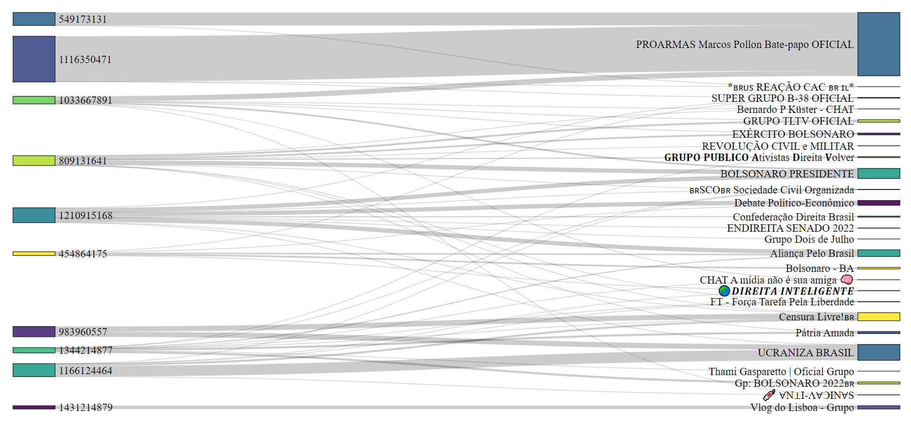
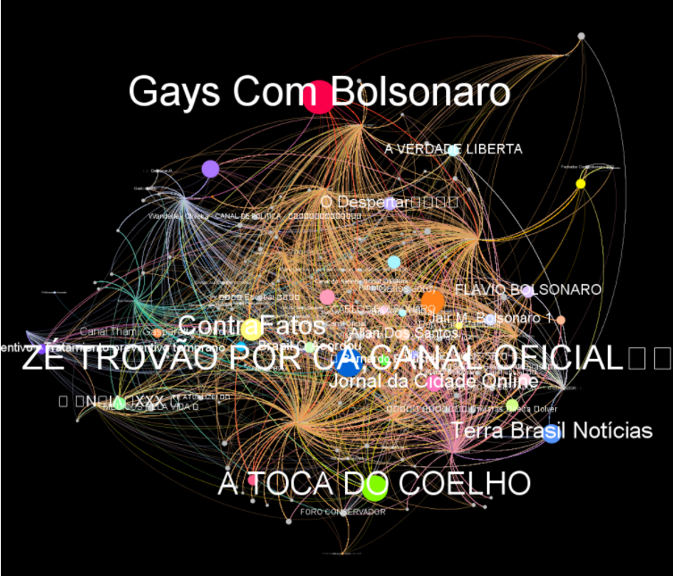
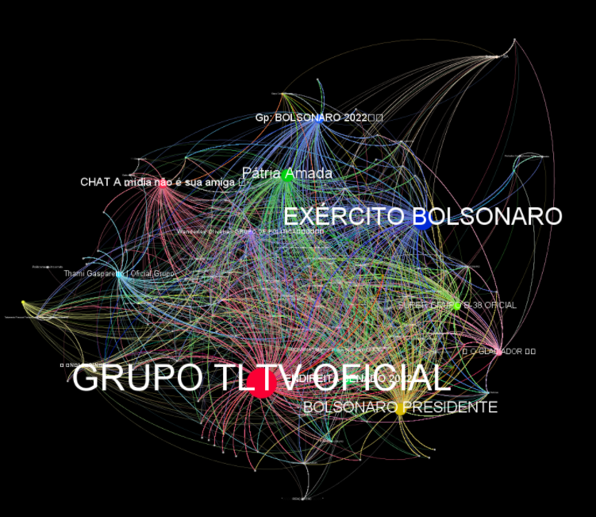
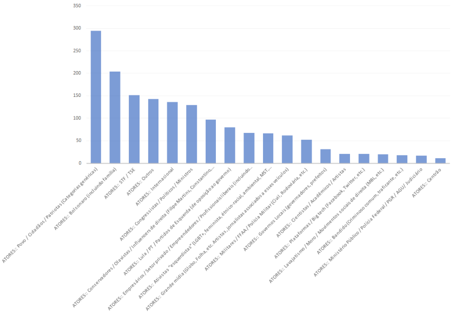
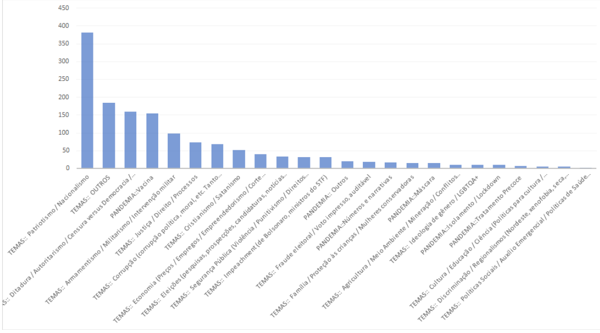
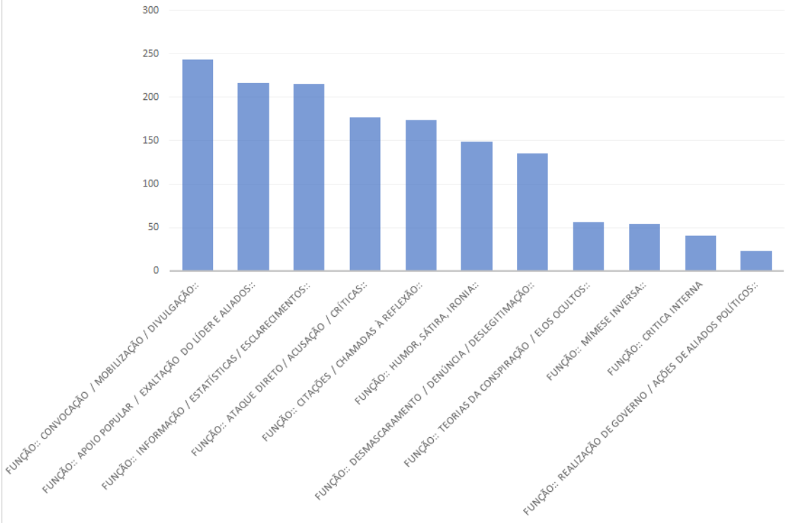
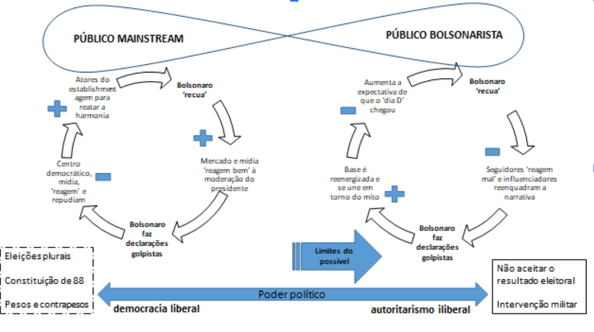

layout: true

```{r setup, include=FALSE}
options(htmltools.dir.version = FALSE)

knitr::opts_chunk$set(
	echo = FALSE,
	fig.align = "center",
	message = FALSE,
	warning = FALSE,
	cache = FALSE,
	error = TRUE
)
library(knitr)
library(widgetframe)
```

---
class: middle, center  

# - Equipe de Pesquisa - 
<br>

## Coordenação: 
<br>

Leonardo F. Nascimento (ICTI/PPGCS/LABHD/UFBA) - Doutor em Sociologia -  [leofn3@gmail.com](mailto:leofn3@gmail.com)
<br>

Letícia Maria Costa da Nóbrega Cesarino (PPGAS/UFSC) - Doutora em Antropologia - [leticia.cesarino@gmail.com](mailto:leticia.cesarino@gmail.com)
<br>

Paulo de Freitas Castro Fonseca (ICTI/LABHD/UFBA) – Doutor em Sociologia - [pfonseca@ufba.br](mailto:pfonseca@ufba.br) 

---
class: middle, center  

# - Equipe de Pesquisa -

## Análise computacional - Ciências de Dados:

Ana Carolina Balbino Silva (LABHD/UFBA) - Bolsista de iniciação científica, Graduanda do Bacharelado Interdisciplinar em Ciência, Tecnologia e Inovação - carolbalbinos@hotmail.com

Daniel de Sena Bastos (LABHD/UFBA) - Bolsista de iniciação científica, Graduando do Bacharelado Interdisciplinar em Ciência, Tecnologia e Inovação -  danielosena@hotmail.com

Iolanda Victoria Morais Ramos (LABHD/UFBA) - Graduanda do Bacharelado Interdisciplinar em Ciência, Tecnologia e Inovação iolanda.ramos07@gmail.com

Tarssio Brito Barreto (LABHD/PEI/UFBA) Cientista de dados e Doutorando do Programa de Pós Graduação em Engenharia Industrial da Universidade Federal da Bahia - PEI/UFBA  - tarssioesa@gmail.com

Thamirys Albuquerque Cunha (LABHD/UFBA) - Graduanda do Bacharelado Interdisciplinar em Ciência, Tecnologia e Inovação t21cunha@gmail.com

Vítor Mussa (DTA/PPGSA/UFRJ) - Engenheiro de dados, Mestrando em Sociologia e Antropologia - vtrmussa@gmail.com

---
class: middle, center  

# Equipe de Pesquisa


## Equipe - Análise qualitativa/Codificação

Anna Carollyne Vieira (PIBIC/LABHD/UFBA) Bolsista IC - PIBIC, Bacharelanda Interdisciplinar em Humanidades - vieiracarol177@gmail.com

Barbara Mendes Lima (FAPESC/PPGAS/UFSC) Bolsista FAPESC, Mestranda em Antropologia Social - barbaramendeslima@outlook.com

Fernanda Luiza Godinho (CAPES/PPGAS/UFSC) - Bolsista CAPES, Mestranda em Antropologia Social - fernandaluiza.b@gmail.com

Gabriel Darío López Zamora (UFSC) Graduado em Antropologia - dario.lopez.z@outlook.com

Jéfte Batista de Oliveira  (PIBIC/LABHD/UFBA) - Bolsista de iniciação científica, Graduado em Ciências Sociais Licenciatura - jeftebatista10@gmail.com

Juciane Pereira de Jesus (PIBIC/LABHD/UFBA) - Bolsista de iniciação científica, Graduanda em Ciências Sociais (licenciatura) - juciane_pereira1997@outlook.com

Larissa Schwedersky (PPGAS/UFSC) - Doutoranda em Antropologia Social - lari.schwedersky@gmail.com

Larisse Amaral Marajó (CNPq/PPGAS/UFSC)  Bolsista CNPq, Mestranda em Antropologia Social - lamarajo@outlook.com

---
class: middle, center  

# Equipe de Pesquisa


## Equipe - Análise qualitativa/Codificação

Larisse Louise Pontes Gomes (PPGAS/UFSC) Doutoranda em Antropologia Social - larisse.louise@gmail.com

Louise Lima Karczeski (CAPES/PPGAS/UFSC) - Bolsista CAPES, Mestranda em Antropologia Social - karczeski.lou@gmail.com

Maria Luiza Scheren (PIBIC/CNPq/UFSC) Bolsista de Iniciação Científica (PIBIC/CNPq), Graduanda em Antropologia 

Maximiano Augusto Gonçalves Neto (FGV) - Mestrando em Bens patrimoniais -  maxagn@gmail.com

Sandra Stephanie Holanda Ponte Ribeiro (GrupCiber/PPGAS/UFSC) - Doutoranda em Antropologia Social - stephanie.hpr@gmail.com

Silvia Rocha Walz  (PIBIC/UFSC) – Bolsista de iniciação científica PIBIC, Graduanda em Antropologia -  silviawalz@hotmail.com

Tatiana Balistieri  (PIBIC/UFSC) - Bolsista de iniciação científica PIBIC, Graduando em Ciências Sociais - tatianabalistieri@gmail.com

Virgínia Squizani Rodrigues (TRANSES/PPGAS/UFSC) Doutoranda em Antropologia Social - virginia.squizani@gmail.com

---
class: middle, center  

# Colaboradores 

Alisson Magalhães Soares (Observatório InCite/UFMG) - Doutor em Sociologia - [alissonmsoares@gmail.com](mailto:alissonmsoares@gmail.com)

Elias Cunha Bitencourt (UNEB/PPGCOM-UFBA/LAB404)  Doutor em Comunicação - [eliasbitencourt@gmail.com](mailto:eliasbitencourt@gmail.com) 

Pedro H. J. Nardelli (CPSG/LUT University) Doutor em Engenharia - [Pedro.Nardelli@lut.fi](mailto:Pedro.Nardelli@lut.fi)

---
class: inverse, center, middle

# Objetivo

---
class: middle, center

## Estabelecer uma estrutura interdisciplinar de mapeamento, monitoramento e análise multi-método (quanti/quali) de grupos e canais bolsonaristas no Telegram.

---
class: inverse, center, middle

# Contexto

---
class: middle, center

--
## aumento acentuado de novos grupos e canais no Telegram de apoiadores e figuras políticas ligadas ao presidente; 
<br>

--
## reorganização das estruturas de rede e estratégias de comunicação nas próximas eleições presidenciais

---
class: inverse, center, middle

# Enquadramento conceitual-analítico

---
class: middle, center

--
## Públicos refratados (Crystal Abidin - 2021);
<br>

--
## "Confusão de fronteiras"(Gray, Bounegru e Venturini, 2020; Abidin, 2021);
<br>

--
## Operação via camuflagem;
<br>

--
## Lógica antagonística não-pluralista;
<br>

--
## **Desestabilização do processo eleitoral em 2022.**


---
class: inverse, center, middle

# Parâmetros éticos de investigação

---
class: middle, center

--
## Grupos e canais públicos
<br>

--
## Anonimização de mensagens e usuários
<br>

--
## *"Lurker"*

---
class: inverse, center, middle

# Coleta de dados 

---
class: middle, center

# Pipeline da extração dos dados

```{r, out.width="100%"}

```

---
class: inverse, center, middle

# Dados coletados

---
class: center, middle

--
# **42 grupos** com + de **277.000 usuários**
<br>

--
# **108 canais** com + de **3.300.000 usuários**

---
class: inverse, center, middle

# Dinâmica de surgimento dos chats

---
class: middle, center


```{r, out.width="70%"}
knitr::include_graphics("./img/timeline_grupos_plot3.jpeg")
```
#### **Gráfico 1 - Linha do tempo dos grupos analisado**
---
class: middle, center


```{r, out.width="60%"}
knitr::include_graphics("./img/timeline_canais_plot3.jpeg")
```
#### **Gráfico 2 - Linha do tempo dos canais analisados**

---
class: inverse, center, middle

# Quantidade de usuários (grupos/canais)

---
class: middle, center

```{r, out.width="100%"}
knitr::include_graphics("./img/plot_users_grupos2.jpeg")
```
#### **Gráfico 3 - Quinze grupos com maior número de usuários**

---
class: middle, center

```{r, out.width="100%"}
knitr::include_graphics("./img/plot_users_canais2.jpeg")
```
#### **Gráfico 4 - Quinze canais com maior número de usuários**


---
class: inverse, center, middle

# Dinâmicas de crescimento dos (grupos/canais)

---
class: middle, center

```{r, out.width="100%"}
knitr::include_graphics("./img/n_users_grupos_plus5k.jpeg")
```
#### **Gráfico 5 - Crescimento do número de usuários nos grupos mais de 5 mil  usuários (jul/out 2021)**

---
class: middle, center

```{r, out.width="100%"}
knitr::include_graphics("./img/n_users_canais.jpeg")
```
#### **Gráfico 6 - Crescimento do número de usuários nos canais com mais de 50 mil  usuários (jul/out 2021)**

---
class: inverse, center, middle

# Dinâmica das mensagens 

---
class: middle, center

```{r, out.width="100%"}
knitr::include_graphics("./img/total_msgs_grupos3.jpeg")
```
##### **Gráfico 7 - Frequência das mensagens postadas nos grupos analisados - Jan/Out 2021. (As mensagens estão classificadas em textuais e de mídia - mensagens com links para redes sociais, áudio, fotos e vídeos.**

---
class: middle, center

```{r, out.width="100%"}
knitr::include_graphics("./img/total_msgs_canais.jpeg")
```
##### **Gráfico 8 - Frequência das mensagens postadas nos canais analisados - Jan/Out 2021. (As mensagens estão classificadas em textuais e de mídia - mensagens com links para redes sociais, áudio, fotos e vídeos**


---
class: inverse, center, middle

# Talkatives

---
class: middle, center

```{r, out.width="100%"}
knitr::include_graphics("./img/top20_bar.jpeg")
```
#### **Gráfico 9 - Total de mensagens dos dez talkatives - Jan/Out 2021**

---
class: middle, center

```{r, out.width="100%"}
knitr::include_graphics("./img/din_top20.jpeg")
```
#### **Gráfico 10 - Dinâmica de mensagens dos dez talkatives - Jan/Out 2021**

---
class: middle, center

```{r, out.width="100%"}

```
#### **Gráfico 11 - Distribuição das mensagens de texto dos dez talkatives nos grupos que participam - Jan/Out 2021**

---
class: inverse, center, middle

# Temáticas 


---
class: middle, center

# Pandemia
```{r, out.width="100%"}
knitr::include_graphics("./img/saude_plot.jpeg")
```
#### **Gráfico 13 - Menções a temas relacionado à pandemia nos chats analisados - Jan/Out 2021**


---
class: middle, center

# Supremo Tribunal Federal
```{r, out.width="100%"}
knitr::include_graphics("./img/STF_plot.jpeg")
```
#### **Gráfico 14 - Menções ao Supremo Tribunal Federal nos chats analisados - Jan/Out 2021**

---
class: middle, center

# MInistros do STF
```{r, out.width="100%"}
knitr::include_graphics("./img/stf_min.jpeg")
```
#### **Gráfico 15 - Menções ao ministros do Supremo Tribunal Federal nos chats analisados - Jan/Out 2021**

---
class: middle, center

# CPI da Covid
```{r, out.width="100%"}
knitr::include_graphics("./img/cpi_plot.jpeg")
```
#### **Gráfico 16 - Menções aos atores políticos na CPI da covid-19 - Jan/Out 2021**

---
class: inverse, center, middle

# Ecossistema multiplataforma de desinformação 

---
class: center, middle

# Websites bolsonaristas 

---
class: middle, center

```{r, out.width="100%"}
knitr::include_graphics("./img/eco_websites2.jpeg")
```
#### **Gráfico 17 - Websites mais citados no chats (grupos e canais) analisados - Jan/Out 2021**
---
class: middle, center

```{r, out.width="100%"}
knitr::include_graphics("./img/eco_din_websites3.jpeg")
```
#### **Gráfico 18 - Dinâmica de links dos três websites mais postados no chats (grupos e canais) analisados - Jan/Out 2021**

---
class: inverse, center, middle

# Redes sociais

---
class: middle, center

```{r, out.width="100%"}
knitr::include_graphics("./img/gfinal2.jpeg")
```
#### **Gráfico 19 - Links para plataformas nos (grupos e canais) analisados - Jan/Out 2021**

---
class: middle, center

```{r, out.width="100%"}
knitr::include_graphics("./img/eco_yt2.jpeg")
```
#### **Gráfico 20 - Dez vídeos do Youtube mais postados nos (grupos/canais) - Jan/Out 2021**


---
class: inverse, center, middle

# Estudo de caso: o 7 de setembro

---
class: middle, center

# Análise topológica da rede do período 


## **184.203 mensagens compartilhadas de 01/9/2021 a 12/09/2021 nos grupos**

---
class: middle, center

```{r, out.width="85%"}

```
##### **Nós proporcionais aos grupos/canais que mais mandam mensagens**

---
class: middle, center


```{r, out.width="85%"}

```
##### ****Nós proporcionais aos grupos/canais que mais recebem mensagens**


---
class: inverse, center, middle

# Análise de imagens compartilhadas entre 01/09/2021 e 12/09/2021

---
class: middle, center

# Atores

```{r, out.width="100%"}

```

---
class: middle, center

# Temáticas

```{r, out.width="100%"}

```

---
class: middle, center

# Funções

```{r, out.width="100%"}

```

---
class: inverse, center, middle

# Resultados preliminares

---
class: middle, center

--
## Papel emergente do Telegram como “dobradiça” do ecossistema multiplataforma do bolsosnarismo;
<br>

--
## Ritmo cíclico

---
class: middle, center

```{r, out.width="100%"}

```

#### **Sistema bifurcado entre públicos refratados e públicos dominantes (Fonte: perfil de Facebook de Christian Lynch, complementado por Letícia Cesarino e Pedro Nardelli**


---
class: inverse, center, middle

# Próximas etapas

---
class: middle, center

--
## 1.Expansão da base de dados;
<br>

--
## 2.Análise dos talkatives;
<br>

--
## 3.Etnografia;
<br>

--
## 4.Ferramentas de monitoramento em tempo real; 
<br>

--
## 5.Técnicas de NLP, AI e ML.


---
class: middle, center

##**Agradecimentos especiais**:

.pull-left[
## Obrigado ao InternetLab!
]
.pull-right[

## Obrigado à toda equipe e aos colaboradores!
]

