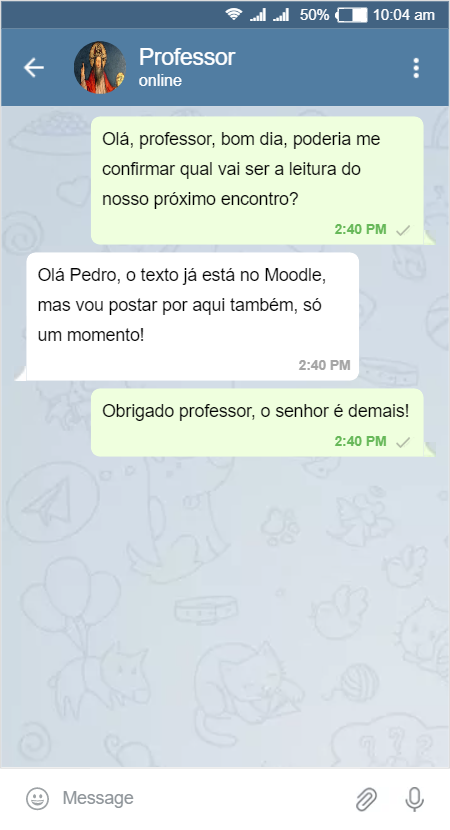
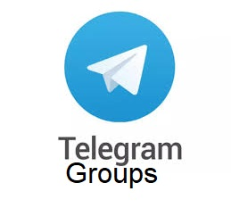

layout: true

```{r setup, include=FALSE}
options(htmltools.dir.version = FALSE)

knitr::opts_chunk$set(
	echo = FALSE,
	fig.align = "center",
	message = FALSE,
	warning = FALSE,
	cache = FALSE
)
```

```{r eval=FALSE, include=FALSE}
library(knitr)
library(tidyverse)
library(widgetframe)
```

---

class: middle, center  

```{r, out.width="50%"}
knitr::include_graphics("img/logo_MA_color.png")
```

# LABHDUFBA


Twitter: [@labhdufba](https://twitter.com/labhdufba) 
<br>
Instagram: [@labhdufba](http://instagram.com/labhdufba)
<br>
Github: [https://github.com/LABHDUFBA](https://github.com/LABHDUFBA)
<br>
Youtube: [Clique aqui](https://www.youtube.com/channel/UCjUf9BsbG-C-gpA54zvOgBw)

---
class: inverse, center, middle

# Vamos começar...

---
class: middle, center

# O que é o telegram? 

```{r, out.width="60%"}
knitr::include_graphics("https://media.giphy.com/media/ya4eevXU490Iw/giphy.gif")
```

> "Um Telegram é um software utilizado para comunicação e mensagens instantâneas e oferece diversas possibilidades, como o envio de diversos arquivos de mídia, além de realizar chamadas de voz ou vídeo. Ele foi criado 2013, depois foi desenvolvido em várias versões e adicionou muitas tecnologias modernas e recursos de segurança"

---
class: middle, center

# Por que usar?
<br>

--
### Gratuito! 💸
<br>

--
### Pode ser usado em vários sistemas operacionais; 🍌🍉🍓🍇
<br>

--
### Pode ser usado em celulares, desktops e você pode abri-lo em diferentes navegadores da web; 💻💾📟📱
<br>

--
### É leve! 🍃🍃🍃🍃
<br>

--
### É russo... 🐻😂😂😂


---
class: middle, center

# Por que usar?
<br>

--
### Privacidade: permite ocultar seu número de telefone dos contatos; 🔒🔒🔒
<br>

--
### É possível ver todo o histórico de mensagens; 📜📜📜
<br>

--
### Taxa de alta segurança por meio de um sistema de alta criptografia. 🔑🔑🔑
<br>

--
### Você pode modificar e excluir mensagens facilmente; 💥💥💥
<br>

--
### Permites bots de segurança, personalização e conteúdo. 🤖🤖

---
class: middle, center

#  Telegram para fins educacionais

.pull-left[
```{r, out.width="90%"}

```
]
.pull-right[

<br>
<br>
## Canal de comunicação entre o professor, turmas e estudantes

]

---
class: middle, center

#  Telegram para fins educacionais

.pull-left[
```{r, out.width="75%"}

```
]
.pull-right[

<br>
<br>
## Grupos de discussão e enquetes, compartilhamento de todo o material da disciplina, links e atividade

]
---


---
class: middle, center

--
# Grupo ou Canal da disciplina?
<br>

--
```{r, out.width="40%"}

```


--
## Os Grupos do Telegram são ideais para compartilhar coisas entre todos os membros do grupo. Em princípio todos no grupo podem postar coisas. Trata-se de uma ferramentas multidirecional!
<br>

---
class: middle, center

--
# Grupo ou Canal da disciplina?
<br>

--
```{r, out.width="35%"}

```


--
## Canais são uma ferramenta para transmitir mensagens para grandes públicos. Cada mensagem em um canal tem um contador de visualizações que é atualizado quando a mensagem é visualizada e os inscritos no canal podem comentar coisas. Ferramenta unidirecional!


---
class: middle, center

## "Regimento" dos espaços digitais de convivência


> "Este grupo é para troca de informações e notícias relacionados à disciplina <nome da disciplina>. A príncípio todos os estudantes poderão participar deste que sejam respeitadas as regras de convivência e respeito entre os membro. Trata-se de um espaço acadêmico virtual e todas as regras do regimento da UFBA valem aqui" 

---
class: inverse, center, middle

# O que é big data?


---
class: inverse, center, middle

# Qual o desafios do uso de big data nas pesquisas em ciências sociais?

```{r, out.width="60%"}
knitr::include_graphics("https://media.giphy.com/media/atZII8NmbPGw0/giphy.gif")
```

---
class: middle, center

# Precisamos deixar de ser noobs!
```{r, out.width="60%"}
knitr::include_graphics("https://media0.giphy.com/media/CjmvTCZf2U3p09Cn0h/giphy-downsized.gif")
```

---
class: middle, center

# Nunca tivemos tantos dados, ferramentas, técnicas... 

```{r, out.width="85%"}
knitr::include_graphics("https://media.giphy.com/media/YnlDGfCxyOIYTDp86I/giphy.gif")
```

---
class: middle, center

# ..mas nossos problemas NÃO acabaram! 

```{r, out.width="85%"}
knitr::include_graphics("https://media.giphy.com/media/H0kxiS2RJF2HC/giphy.gif")
```

---
class: inverse, center, middle

# Três grandes eixos de desafios:

---
class: middle, center

--
## 1. fontes digitais da pesquisa
<br>

--
## 2. métodos e técnicas digitais
<br>

--
## 3. vigilância epistemológica das pesquisas em meios digitais
<br>

---
class: middle, center
# 1. Desafios das fontes da pesquisa
<br>

--
## publicidade/acessibilidade
<br>

--
## evocação versus coleta
<br>

--
## representatividade
<br>

--
## pré-construção	algorítimica dos dados
<br>

--
## capacidade computacional
<br>

---
class: middle, center
# 2. Desafios das técnicas e métodos
<br>

--
## letramento digital dos pesquisadores
<br>

--
## pré-construção	algorítimica das ferramentas ("black-box")
<br>

--
## cuidado com o soterramento! (download *versus* capacidade analítica)

---
class: middle, center

## Obrigado gente!

.pull-left[
```{r, out.width="100%"}
knitr::include_graphics("https://media1.giphy.com/media/3oz8xIsloV7zOmt81G/giphy.gif")
```
]
.pull-right[
##**Agradecimentos especiais**:
### Prof. Dr. Edison Bertoncelo - Pelo convite!
<br>
### Ao público pela paciência!
]

